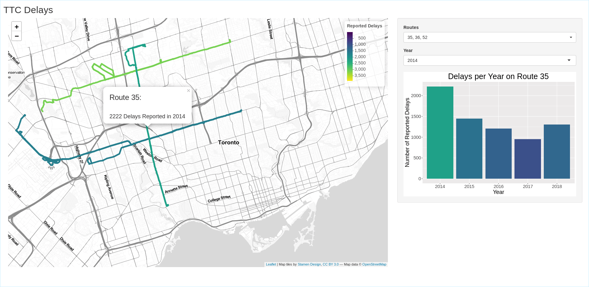

# Mapping Bus Delays on the TTC

Public transportation is great in Toronto! The Toronto Transit Commission (TTC) Buses, streetcars, and subways can get you anywhere you need to go. However, travellers need to factor in their commute with the TTC.

This shiny app is meant to visualize the bus routes with the most delays over the course of the past few years. It allows you to select a route or multiple routes, and a year, and shows it on a map, colormapped to represent how many delays were reported. Clicking on a route gives more information, and creates a bar plot showing number of delays through the years.

The app is live on [shinyapps.io](https://sacul.shinyapps.io/ttc_delays/)! Feel free to check it out!

The delay data is acquired from the [Toronto Open Data Catalogue](https://www.toronto.ca/city-government/data-research-maps/open-data/open-data-catalogue/), and the bus route data is collected from OSM using the [osmdata](https://github.com/ropensci/osmdata) `R` library. The `get_data.R` script downloads and processes the data, and the processed data used in the app can be found in `data/Data.rds`.

## TODO:

* Considering that the bus routes don't all run the same amount of times each day, it would be more informative to include number of delays per scheduled hour. I need to find proper data for how frequently each line was supposed to (or did) run throughout the years.
* Toronto Open Data is in the process of creating an Open Data Portal, which would include an API to access data. Once this is available, I will be able to update the `get_Data.R` script to be able to download and process the data more efficiently.
