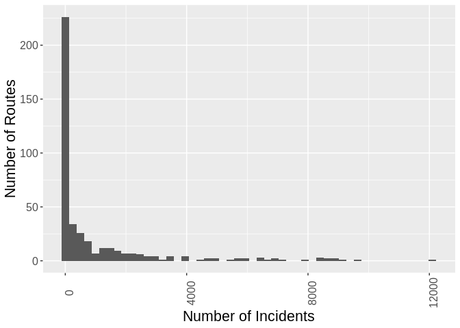
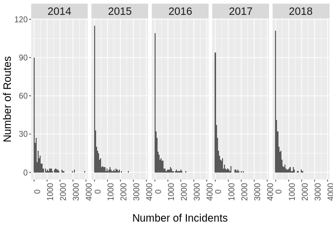

Some basic data exploration
===========================

``` r
library(tidyverse)
library(lubridate)

# Load the data
routes <- readRDS("../data/busroutes.rds")
delays <- read_csv("../data/delay_data.csv")
```

Check out if the incidents and delays are evenly spread across routes:

``` r
# summarize the incidents per route in whole dataset
inc_route <- delays %>% 
    group_by(Route) %>% 
    summarize(n_incidents = n())

# Histogram of number of incidents per route
h1 <- ggplot(data = inc_route, aes(n_incidents)) +
    geom_histogram(bins = 50) +
    labs(x = "Number of Incidents",
         y = "Number of Routes") +
    theme(axis.text.x = element_text(angle = 90, size = 12),
          axis.text.y = element_text(size = 12),
          axis.title.x = element_text(size = 16),
          axis.title.y = element_text(size = 16))

h1
```



This shows that the majority of routes had very few incidents between 2014 and 2018, and a few routes were very problematic. Just to check in slightly finer grain, it's good to know if it was this way year-to-year.

``` r
inc_year_route <- delays %>% 
    mutate(year = format(.$Report_Date, '%Y')) %>% 
    group_by(Route, year) %>% 
    summarise(n_incidents = n())

h2 <- ggplot(data = inc_year_route, aes(n_incidents)) +
    geom_histogram(bins = 50) +
    facet_grid(~ year) +
    labs(x = "\nNumber of Incidents\n",
         y = "Number of Routes") +
    theme(strip.text.x = element_text(size = 16),
          axis.text.x = element_text(angle = 90, size = 12),
          axis.text.y = element_text(size = 12),
          axis.title.x = element_text(size = 16),
          axis.title.y = element_text(size = 16))

h2
```



Indeed, in all years, it seems the distribution of incidents is not equal across routes: most routes get very few reported delays, and some get the vast majority. In fact, every year, there are some routes that have thousands of reported delays!
